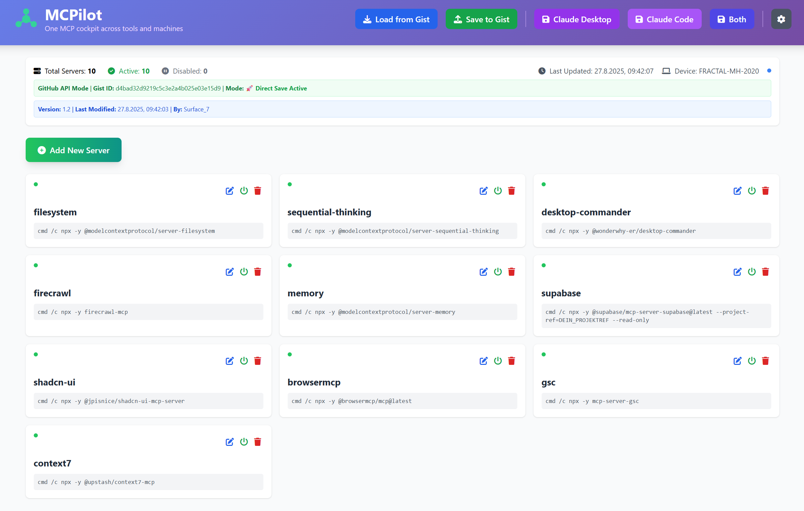

# 🚀 MCPilot

> **One MCP cockpit across tools and machines - Direct-save configuration management for Claude Desktop and Claude Code with GitHub Gist sync**


MCPilot saves your Claude configurations **directly** to the correct directories - no downloads, no manual copying! Sync across all your PCs using GitHub Gist.

## 📸 Screenshot



*MCPilot in action - showing 10 configured MCP servers across multiple machines*

## ✨ Key Features

- 💾 **Direct Save** - Saves directly to Claude config directories
- 🔄 **Multi-PC Sync** - Centralized configuration via GitHub Gist
- 🔒 **Automatic Backups** - Timestamped backups before every save
- 📊 **Version Control** - Automatic versioning of all changes
- 🚀 **One-Click Apply** - No manual file handling needed
- 🎨 **Modern UI** - Clean interface with real-time status

## 📋 Requirements

- **Windows 10/11, macOS, or Linux**
- **Node.js 14+** - [Download](https://nodejs.org/)
- **GitHub Account** with Personal Access Token
- **Web Browser** (Chrome, Edge, Firefox, Safari)

## 🔧 Quick Start

### 1. Install Node.js
Download and install from [nodejs.org](https://nodejs.org/) (LTS version recommended)

### 2. Create GitHub Token
1. Go to GitHub → Settings → Developer settings → [Personal access tokens](https://github.com/settings/tokens)
2. Click **"Generate new token (classic)"**
3. Name it: "MCPilot"
4. Select scope: **`gist`** ✅
5. Generate and **copy the token** (starts with `ghp_`)

### 3. Create a Gist
1. Go to [gist.github.com](https://gist.github.com)
2. Filename: `mcp.txt`
3. Content:
```json
{
  "mcpServers": {},
  "version": "1.0",
  "lastModified": null
}
```
4. Create gist and copy its ID from the URL

### 4. Download & Run

**Windows:**
```bash
git clone https://github.com/markushoefinger/MCPilot.git
cd MCPilot
START.bat
```

**macOS/Linux:**
```bash
git clone https://github.com/markushoefinger/MCPilot.git
cd MCPilot
node server-advanced.js
```
Then open your browser and navigate to `http://localhost:8080`

### 5. Configure
1. Click the gear icon ⚙️
2. Enter your GitHub token and Gist ID
3. Save settings

## 🎯 Usage

### Starting the Server

**Windows:**
```batch
START.bat
```
Opens browser automatically at `http://localhost:8080`

**macOS/Linux:**
```bash
node server-advanced.js
```
Then manually open `http://localhost:8080` in your browser

### Managing Configurations

1. **Load from Gist** - Fetch current configuration
2. **Add/Edit Servers** - Manage your MCP servers
3. **Save to Gist** - Update central storage
4. **Apply to Claude** - Click buttons to save directly:
   - **Claude Desktop** → `%APPDATA%\Claude\claude_desktop_config.json`
   - **Claude Code** → `%USERPROFILE%\.claude.json`
   - **Both** → Saves to both locations

### Status Indicators
- 🚀 **Direct Save Active** - Server running, direct save enabled
- 💾 **Backup created** - Automatic backup before each save
- ✅ **Saved successfully** - Configuration applied

## 📁 File Locations

### Configuration Files

**Windows:**
- **Claude Code**: `%USERPROFILE%\.claude.json`
- **Claude Desktop**: `%APPDATA%\Claude\claude_desktop_config.json`

**macOS:**
- **Claude Code**: `~/.claude.json`
- **Claude Desktop**: `~/Library/Application Support/Claude/claude_desktop_config.json`

**Linux:**
- **Claude Code**: `~/.claude.json`
- **Claude Desktop**: `~/.config/Claude/claude_desktop_config.json`

### Automatic Backups

**Windows:**
- **Claude Code**: `%USERPROFILE%\backups\`
- **Claude Desktop**: `%APPDATA%\Claude\backups\`

**macOS/Linux:**
- **Claude Code**: `~/.claude-backups/`
- **Claude Desktop**: Configuration directory + `/backups/`

*Latest 10 backups are kept, older ones auto-delete*

## 🔒 Backup System

Every save automatically creates timestamped backups:
```
backups/
├── claude-2024-12-26T10-30-45.json
├── claude-2024-12-26T09-15-22.json
└── ... (max 10 backups)
```

## 🔧 API Endpoints

The server provides REST endpoints for automation:

- `GET /api/status` - Server status and capabilities
- `GET /api/settings` - Current settings
- `POST /api/settings` - Update settings
- `POST /api/save-config` - Direct save to system
  ```json
  {
    "config": { /* your config */ },
    "target": "code" | "desktop" | "both"
  }
  ```

## 🛠️ Troubleshooting

### Node.js Issues
```bash
# Verify installation
node --version  # Should show v14+
npm --version   # Should show v6+
```

### Server Won't Start
- Check if port 8080 is free
- Run as administrator if permission errors
- Ensure Node.js is in PATH

### GitHub Token Invalid
- Token must have `gist` scope
- Regenerate if expired
- Check for typos (should start with `ghp_`)

## 📝 Project Structure

```
mcpilot/
├── index.html          # Web interface
├── app.js             # Client application
├── server-advanced.js # Node.js server
├── START.bat          # Launcher
├── package.json       # Node.js config
└── README.md          # Documentation
```

## 🤝 Contributing

Pull requests welcome! Please:
1. Fork the repository
2. Create a feature branch
3. Commit your changes
4. Push to the branch
5. Open a Pull Request

## 📄 License

MIT License - see [LICENSE](LICENSE) file

## 🙏 Credits

- [Claude](https://claude.ai) by Anthropic
- [Tailwind CSS](https://tailwindcss.com)
- [Font Awesome](https://fontawesome.com)

---

**Made with ❤️ for the Claude MCP community**